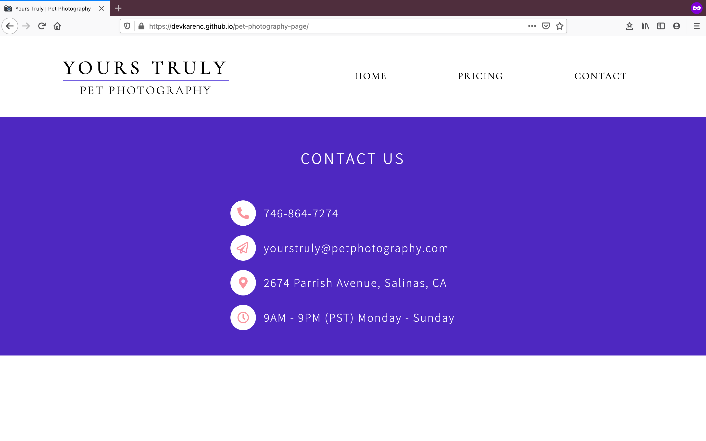

# Pet Photography Business Website 📷

This website is built for an imaginary client who runs a pet photography business. The site consists of 3 main pages: Home, Pricing, and Contact.
The goals of this project were to:

- [x] Practice DOM manipulation and dynamic rendering using JavaScript
- [x] Structure the code base using ES6 modules
- [x] Implement the Single Responsibility principle
- [x] Use the import and export statements
- [x] Bundle modules with Webpack

Check out the website [here](https://devkarenc.github.io/pet-photography-page/).

## Homepage 🐱

## Pricing 🐶

## Contact 🐾

